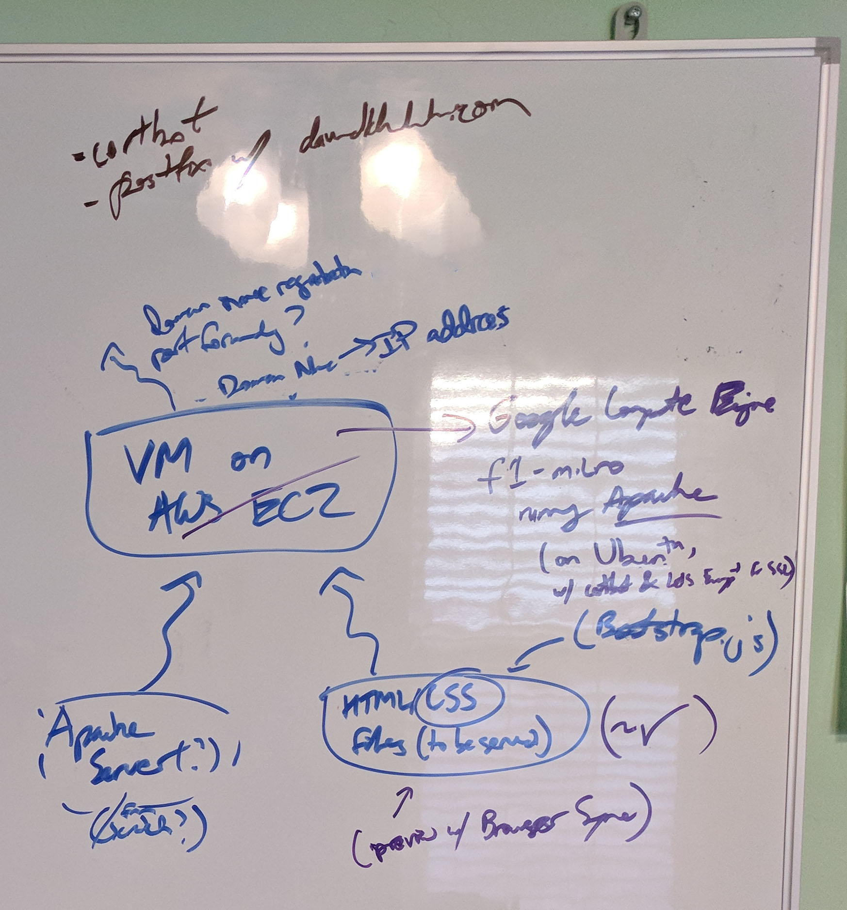

<!-- ## BEGIN METADATA ##
title::Setting up a website and mailing address for $12 a year
date:: October 25 2017
## END METADATA ## -->

# How you, too, can have your own website and personal mailing address for $12 a year\*!
_\*Subject to costs in registering the domain of your choice._

I've had this vague notion of wanting to make a website for myself for a while now. Its original purpose was largely frivolous, largely blog-like -- so that all three interested parties can read about what I've done, what I want to do, and what I think or want to share (there are so many neat things in the world, after all!), I suppose? After a while, I figured it'd be more convenient and seem more "professional" and help "build my brand" to have my own little corner of the internet to point to on resumes and the like. Unfortunately, this shift in frame to a more professional aim may behoove me to sound more "professional" and less frivolous with any musings I may publish -- but I suppose we'll see how that goes once I made a home for any such musings.

In any case, I finally got serious about getting a website up and running and wanted to build things from scratch. Not really because it's cheaper (despite what the title may lead one to believe). I wanted to get a better feel for what goes inside making a website operational (turns out, quite a bit -- "full stack web dev" isn't easy, who woulda thunk?).

As a fun aside, here is what my initial flowchart looked after noting just _a few_ of the changes that took place once I actually started building the website:

_Moral of the story: A plan never survives contact with the enemy._

Anyway, before I yammer on for too long, let's quickly list the steps needed to get your own website and mailing address up and running:

1) Design a website.
2) Deploy that website using web server software on a continuously running machine.
3) Obtain a domain name, and point that domain name to your continuously running machine.

And for bonus points,

4) Obtain an SSL certificate from a certificate authority to allow for secure communication between client and server.
5) Set up an SMTP relay server on your continuously running machine to allow for a personalized mail address.

Now, for the tl;dr recommendations to reach the advertised price point:

1) Design a website (using HTML/CSS, etc.)
2) Set up an f1-micro instance running a Linux distro on Google Compute Engine.
	- Reserve a static external IP address and ensure ports 80 and 443 are allowed to listen to external sources through Google's VPC firewall settings.
3) Copy the website files over to your f1-micro instance, and configure Nginx or Apache to serve those files 
4) Obtain a domain name from Google Domains ($12/yr for a .com TLD).
	- Make A records from @ ['no subdomain'] to the external IP address reserved in (2). Might want to have an A record for 'www' ~> [IP address] as well.
5) Obtain an SSL certificate from [Let's Encrypt](https://letsencrypt.org/) using certbot, and set up a cron task for certbot to renew the SSL certificates as needed.
6) Set up an SMTP relay server on your instance using postfix, then have Mailgun send and receive email from your personalized email address using your configured relay server.
	- Some relevant links [for Google Compute Engine](https://cloud.google.com/compute/docs/tutorials/sending-mail/) and [Mailgun](https://renzo.lucioni.xyz/mail-forwarding-with-mailgun/).

Now, let's not be so glib (and instead be possibly excessively verbose)! Let me expound upon my personal experience going through this process:

## 1) Website design: Not necessarily a quick process.
You can certainly build all the HTML and CSS from scratch if you'd like to fast-forward to a more usable state, it's worth checking out different HTML/CSS templates available online. For example, I modified an example from the Bootstrap website. From there, just make sure your file structure makes sense to you and you hook your <\a href>'s properly, and you're good to go.

This was my first non-trivial use of HTML and CSS, so it was definitely slow-going. But now I feel a bit more comfortable with tweaking the look of things via HTML, and I at least feel comfortable enough with CSS to recognize what I'd need to modify if I wanted to change the look of a defined class. [BrowserSync](https://browsersync.io) made the process much quicker. The automatic refreshes it facilitates after I modified the source code made front-end design/tweaks far less painful.

## 2) Web server setup: Lean software for a tiny VM. 
Only the Linux server distributions come with no strings attached (makes sense in retrospect -- Windows Server licenses aren't free after all), so I got to recall all the neat programs standard on Linux OSes. I'm really partial to bash over cmd though, so that wasn't too bad. Before I forgot, I reserved a static external IP address for DNS registration later on (though I didn't know how I would be doing that -- more on that later).

I was originally going to use Apache as my web server, but a friend of mine advised me to choose nginx because "Apache sucks". As incontrovertible as that argument may be, I did a little bit of outside reading ([here](https://www.digitalocean.com/community/tutorials/apache-vs-nginx-practical-considerations)) before making my decision. I ultimately went with his suggestion. Nginx is built to scale easily and efficiently while running on minimal resources compared to Apache (ah, the joys of event-driven programming ~ ), so it's probably a better choice on our __certifiably redoubtable__ 0.2 vCPUs and 0.9 GB RAM. But before we get too carried away, we still have a domain name to buy!

## 3) Domain registration: A tale of two titans, and learning about the tubes of the internet.
I figured I owed Google some patronage since I was mooching off the free tier of their Google Compute Engine, so I bought davidkhachatrian.com through Google Domains. I had thought all domain registrars are roughly the same in price, but I since realized that Google Domains's flat $12/yr price was much better than that of other common domain registrars: Namecheap, whom I would have used otherwise, offers a lower price for the first year, but their cost of renewal and WHOIS privacy protection soon counteracts any first-year discounts relative to Google's $12/yr flat fee. So even better -- my patronage is doubly deserved.

Titans aside, my main thought after my purchase was "OK, now what?" I never was sure exactly how I was supposed to "tell the internet" where my website is, how to update the DNS to point to my IP address. Google Domains didn't exactly make this all too clear either, but Google Search was there to point me to resource records. (Totally makes sense that something like resource records would exist, but that's something you normally just take for granted when you type in the name of a website.) So off I went to update the resource records, and all was well. Until...

## 4) Email, Part I: Just, just the worst.\*
\*Turns out, not (entirely) email's fault.

The goal was to set up my DNS records and VM instance so that I could use david@davidkhachatrian.com as an alias on a GMail account (to which I have much quicker access). This *would* require setting up an SMTP mail server on my instance so that GMail could verify I had access to this other email account on this other server. (Little did I know at the time that this was doomed to fail -- more on that later.)

So I went through guide after guide and doc page after doc page configuring postfix, configuring nginx, setting up HTTP authentication scripts (for nginx), self-signing certificates (for my SMTP server), and pulling my hair out in frustration as I noted that telnet happily connected to my SMTP servers through localhost but never through my external IP address. Hilariously, I somehow forgot that firewalls existed and only explictly opened ports 25, 465, and 587 for inbound and outbound connections -- or so I had thought. In total, I probably spent the better part of two days before contacting Google Cloud Support explaining my woes -- and learning the truth.

It wasn't all bad. I learned a great deal about how mail works, the certification creation process, and some slightly-past-beginner use-cases for nginx. But I had thrown up my hands and decided I needed to switch tasks while waiting for a response from Google Cloud Support, for my sanity if nothing else.

## 5) SSL certificates: And people normally pay *how much* for these?
Answer: way more than one should.

There's an argument to be had if I were trying to open up an e-commerce platform; Extended Validation SSL certificates definitely have a place there. But for a website that's currently just a landing page and that probably won't be storing a database of user credentials anytime soon, it would be highway robbery to pay >$20 a year for the cheapest commercially available SSL certificate.

Thankfully, the Internet Security Research Group agrees, so they made [Let's Encrypt!](https://letsencrypt.org/), a completely free certificate authority for these sorts of less critical use-cases. The Electronic Frontier Foundation made the complementary program, certbot, which automates certificate requests from Let's Encrypt (and presumably boasts integration with web servers like nginx, but I found I had to manually configure the server files myself). Of course, rarely does something work perfectly the first time. Turns out there's a bit of a chicken-and-egg problem when trying to receive the first batch of certificates for the website. Let's Encrypt doesn't see proof that you're the rightful owner of the websites you're claiming to get, so it refuses. Makes sense in hindsight -- would be a bit awkward if I could get a certificate for facebook.com just by asking. Using "certbot certonly --webroot" solved this. And after determining that "certbot renew" would successfully update the certificates and figuring out how cron works, I set up an automated update.

Fun stuff! But what about the mail?

## 6) Email, Part II: 10/10 customer support and a Mailgun.

Got back a response from Google Cloud Support. Turns out my firewall configurations were for naught -- Google specifically blocks outbound connections from the common mail ports 25, 465, and 587. _(Oh, and how I sighed in exasperation~)_

The support representative, John, linked me to [the relevant page](https://cloud.google.com/compute/docs/tutorials/sending-mail/) documenting the block and ways to send mail despite it. A quick aside: John, you're honestly great. I did not expect such encouragement and cheer from a support representative, but your excitement at hearing I solved my problem with your help made my day. 

")

I looked into the different email senders the documentation page suggested: Sendgrid, Mailgun, and Mailjet. Google searching quickly eliminated Mailjet. I originally chose Sendgrid but soon found out that while it may excel at sending emails (hence the name), it was far more cumbersome to handle the reception of emails at an email address. So in the end, I switched to Mailgun and, after configuring my MX records, rejoiced in having finally established my GMail alias. I still find it kind of funny that the only method to make this work on Google's VMs is through a bulk mail service, and I realized through some initial alias testing that Mailgun's servers (again, unsurprisingly in retrospect) send out emails in waves, meaning that it may sometimes take over ten minutes for an email from [david@davidkhachatrian.com](mailto:david@davidkhachatrian.com) to reach its destination. But hey, it ends up getting there, so whatever works, right?

Here we stand now: definitely a little older, hopefully a little wiser, and probably disproportionately closer to gray hair. But I think it was a worthwhile experience -- if nothing else, knowing that I've barely scratched the surface, I have a more informed appreciation for the effort that goes into web development.

\- DK, 10/25/17
